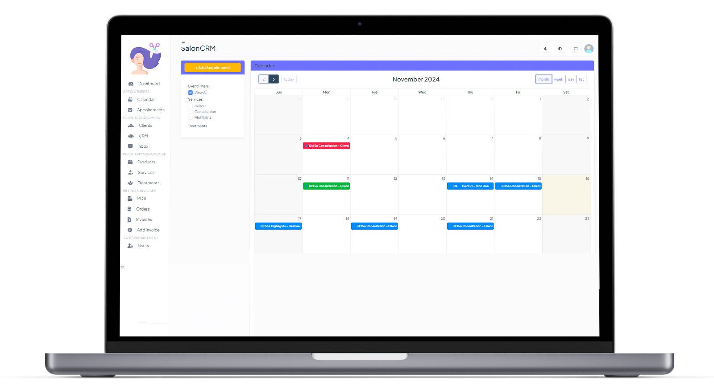
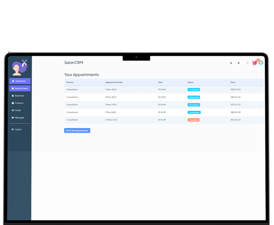
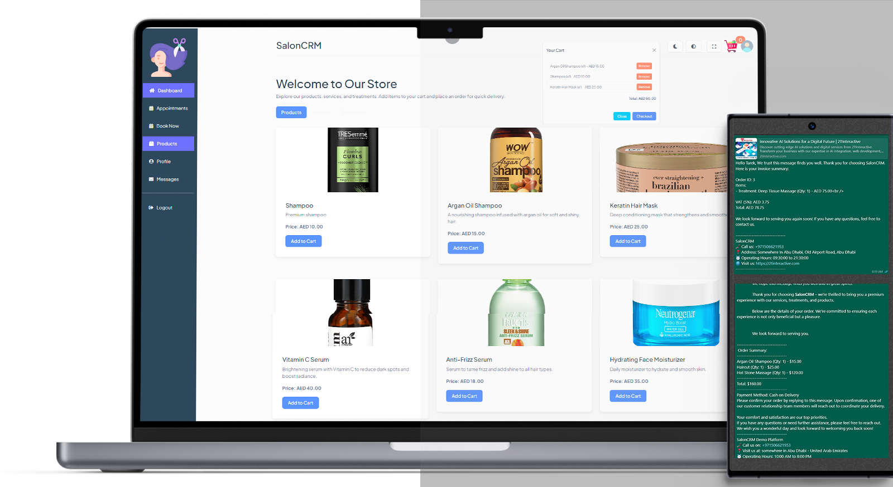
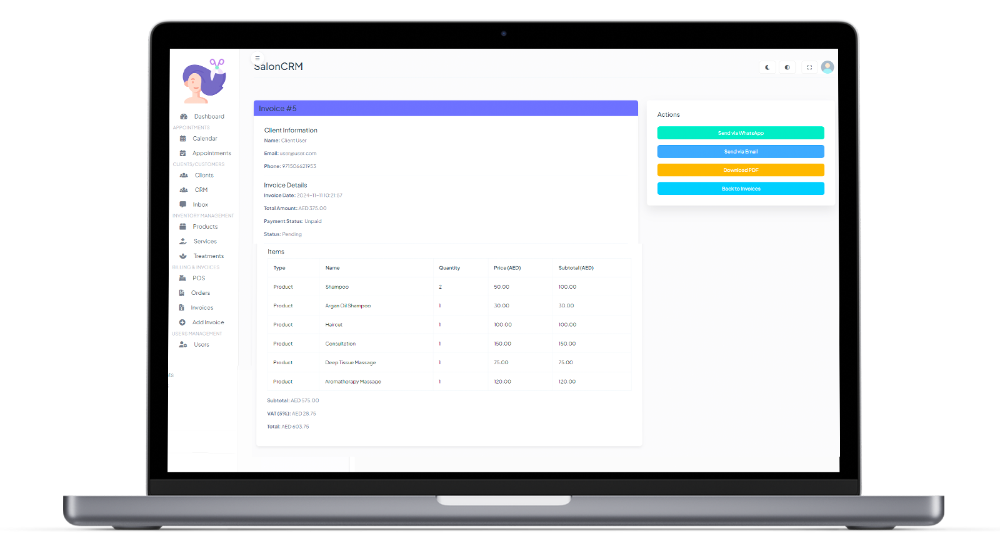
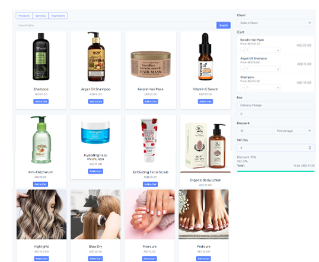

# SalonCRM

SalonCRM is an all-in-one salon management system designed to simplify daily operations for salons and spa businesses. With a robust suite of features like appointment scheduling, client management, invoicing, inventory tracking, and analytics, SalonCRM empowers salon professionals to deliver exceptional service while optimizing their workflows.

---








---

## 🚀 Features

### Core Features
- **Appointment Scheduling**: Manage bookings with an intuitive calendar interface and automated reminders.
- **Client Management**: Store detailed client profiles, preferences, and visit histories.
- **Point of Sale (POS)**: Streamline payments with integrated POS functionality and flexible billing options.
- **Inventory Management**: Track salon product stock levels in real-time.
- and many many more

### Advanced Capabilities
- **Analytics Dashboard**: Access insights on revenue, customer trends, and employee performance.
- **Loyalty Programs**: Reward loyal clients with points, discounts, and exclusive offers.
- **Automated Notifications**: Send personalized reminders, birthday greetings, and promotional updates.
- **Custom Branding**: Tailor the system to reflect your salon's brand identity.

### Other Features
- Multi-location support for salon chains.
- Staff performance tracking and scheduling.
- Service history and detailed reporting.

---

## 🛠️ Installation

### Prerequisites
- PHP 8.0 or higher
- Composer
- MySQL or MariaDB
- A web server (e.g., Apache, Nginx)

---

### Steps
1. **Clone the Repository**
   ```bash
   git clone https://github.com/yourusername/saloncrm.git
   cd saloncrm

`code
composer install
`

# License 📄
SalonCRM is open-source software licensed under the MIT license.

# Demo 🖥️ 
🚧 A live demo is coming soon!

# Contributing 👥
We welcome contributions! Here's how you can help:


# Fork the repository.
Create a feature branch:

`
git checkout -b feature/your-feature-name
`

Commit your changes:

` 
git commit -m "Add your feature description"
`

# Push to your branch:

`
git push origin feature/your-feature-name  
`


#  Support 📞
If you encounter any issues or have questions, feel free to open an issue or contact us directly via email at support@2tinteractive.com

#  Acknowledgments ❤️

SalonCRM is made with love and dedication to empowering salons worldwide. 
Special thanks to all contributors and testers who make this project possible.
